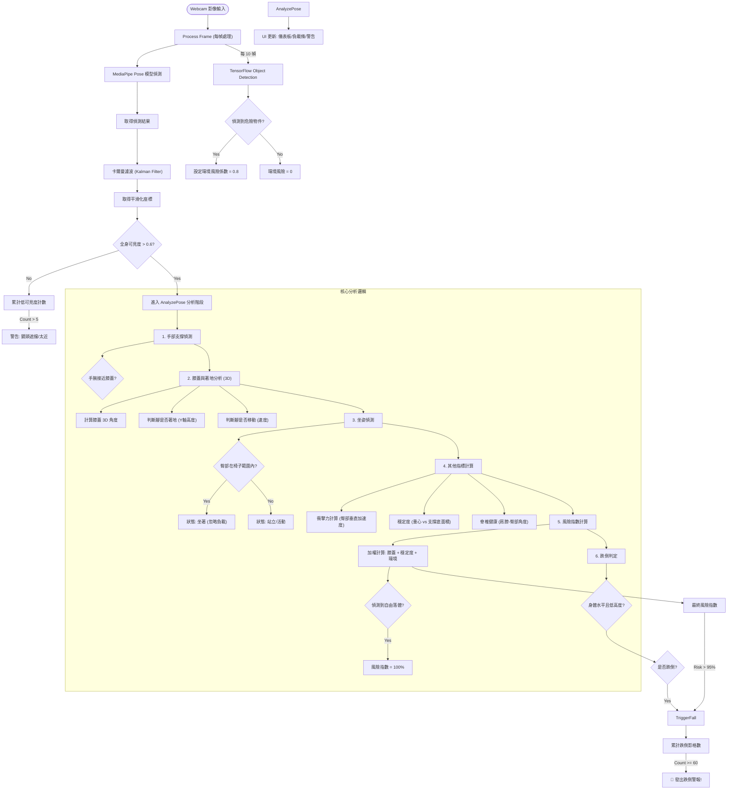

# FallGuard AI 判定邏輯流程圖 (Logic Flow)

此文件詳細描述了 `js/detectors.js` 中的核心判定邏輯與數據流向。

## 系統核心流程 (Mermaid Flowchart)

## 詳細邏輯說明

### 1. 預處理 (Pre-processing)
*   **卡爾曼濾波 (Kalman Filter)**: 為了防止 Webcam 雜訊導致數據跳動，所有的關鍵點座標 (Landmarks) 都會先經過濾波器平滑化。
*   **可見度檢查 (Visibility Gate)**: 系統會檢查肩膀與下半身的關鍵點可見度。如果平均可見度低於 `0.6`，系統會暫停分析並提示使用者調整位置。

### 2. 生物力學分析 (AnalyzePose)

#### A. 著地與支撐 (Grounding & Support)
*   系統計算腳踝 (Ankle) 的 Y 座標。
*   **判定標準**: 如果腳踝高度在地面線 (最低點) 的一定閾值內 (小腿長度的 30%)，則視為「著地」。
*   **穩定計時器**: 如果腳的移動速度極低 (< 0.002)，穩定計時器會增加，進一步確認該腳為有效支撐點。

#### B. 坐姿偵測 (Sitting Detection)
*   利用物件偵測 (Object Detection) 找到的椅子 (Chair/Couch) 邊框。
*   **判定**: 如果臀部 (Hip) 座標位於椅子邊框內，且高度相符，系統判定為「坐姿」。
*   **影響**: 坐姿狀態下，膝蓋負載的權重會被忽略。

#### C. 膝蓋負載 (Knee Load)
*   **資料來源**: 使用 `poseWorldLandmarks` (3D 座標)。
*   **公式**: 計算 臀部-膝蓋-腳踝 的 3D 夾角。
*   **壓力值**: 角度越小 (蹲越低)，壓力越大。若偵測到落地衝擊 (Impact)，壓力值會瞬間加乘。

#### D. 脊椎健康 (Spine Health)
*   計算 肩膀中心 與 臀部中心 的連線角度。
*   **判定**: 如果前傾角度 > 45 度，標記為 `Poor` (姿勢不良/駝背)。

### 3. 風險評估 (Risk Assessment)

系統計算一個 **0-100%** 的綜合風險指數 (`riskIndex`)：

*   **基礎權重**:
    *   **膝蓋風險 (30%)**: 基於膝蓋彎曲角度。
    *   **穩定度風險 (40%)**: 基於重心 (X軸) 偏離雙腳中心的程度。
    *   **環境風險 (20%)**: 是否有障礙物在腳邊。
*   **特殊加權**:
    *   **自由落體 (Freefall)**: 若偵測到急劇的垂直加速度，風險直接設為 100%。
    *   **脊椎不良**: 風險指數 +10%。

### 4. 跌倒觸發 (Fall Trigger)

觸發紅色警報需要滿足以下條件之一，並持續 **60 個影格** (約 2 秒，避免誤判)：

1.  **幾何跌倒判定 (`checkFall`)**:
    *   身體角度 < 45 度 (變成水平)。
    *   臀部高度 > 0.5 (位置很低)。
2.  **高風險指數**:
    *   `riskIndex` >= 95%。
