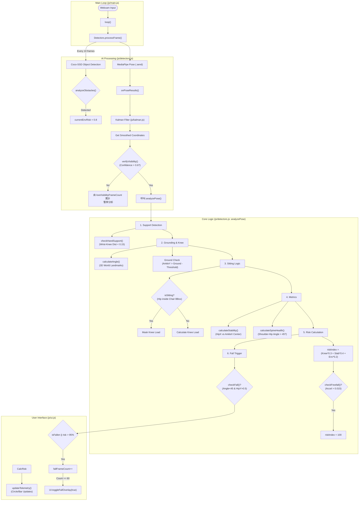

# FallGuard AI 判定邏輯流程圖 (Logic Flow)

此文件詳細描述了 `js/detectors.js` 中的核心判定邏輯、數據流向，以及系統使用的核心模組。

## 1. 使用模組與技術 (Modules & Libraries)

系統整合了多個 AI 模型與演算法來達成精準偵測：

| 模組稱呼 | 函式庫/來源 | 用途說明 | 關鍵程式碼檔案 |
| :--- | :--- | :--- | :--- |
| **Pose Detector** | `@mediapipe/pose` | **人體姿態估計**。提供全身 33 個關鍵點的 2D (影像座標) 與 3D (世界座標) 數據。 | `js/detectors.js` |
| **Object Detector** | `@tensorflow-models/coco-ssd` | **物件偵測**。用於識別環境中的「椅子 (chair)」或「障礙物」，輔助判斷坐姿與環境風險。 | `js/detectors.js` |
| **Neural Network** | `@tensorflow/tfjs` | TensorFlow 的 WebGL 後端，加速神經網路運算。 | `index.html` (CDN) |
| **Kalman Filter** | 自定義 (`js/kalman.js`) | **卡爾曼濾波器**。用於平滑化 3D 座標，消除 Webcam 抖動，並預測被遮擋時的軌跡。 | `js/kalman.js` |
| **3D Visualizer** | `three.js` | **3D 渲染引擎**。將 AI 算出的 3D 骨架渲染到網頁上，提供空間視覺化。 | `js/visualizer.js` |

## 2. 系統核心流程 (Mermaid Flowchart)



## 3. 詳細判定邏輯 (Detailed Logic)

以下是程式碼中具體的數學判定邏輯：

### A. 跌倒判定 (Fall Detection)
位於 `detectors.js` -> `checkFall()`

判定一個人是否跌倒，必須**同時符合**以下兩個條件：

1.  **身體角度水平 (Horizontal)**:
    *   計算 **肩膀中心** 與 **臀部中心** 的連線角度。
    *   **判定**: `角度 < 45 度` (表示身體接近躺平)。
2.  **高度過低 (Low Position)**:
    *   **判定**: `臀部 Y 座標 > 0.5` (在畫面的下半部)。

**觸發機制**:
*   如果上述條件成立，**或者** `風險指數 >= 95%`。
*   `fallFrameCount` 會開始累加。
*   當 `fallFrameCount >= 60` (約持續 2 秒) 時，正式發出紅色警報。

### B. 坐姿偵測 (Sitting Detection)
位於 `detectors.js` -> `analyzePose (Step 2b)`

1.  輸入: `seatObjects` (來自 COCO-SSD 的偵測框)。
2.  **判定**:
    *   `hipX` (臀部 X) 位於椅子邊框寬度內。
    *   `hipY` (臀部 Y) 位於椅子邊框高度內。
    *   `椅子底部 Y` 與 `腳踝 Y` 的差距 < 0.1 (檢查深度/高度是否合理)。
3.  **結果**: 若符合，標記 `isSitting = true`，此時膝蓋負載計算會被暫停或忽略。

### C. 膝蓋負載計算 (Knee Load)
位於 `detectors.js` -> `analyzePose` & `calculateAngle`

1.  **3D 角度**: 使用 `Pose World Landmarks` 計算向量夾角。
    *   `Angle = acos( dot(v1, v2) / (|v1| * |v2|) )`
    *   其中 v1 = 大腿向量, v2 = 小腿向量。
2.  **壓力評估**:
    *   角度越小，壓力越大。
    *   `壓力值 = (180 - Angle) / 0.9` (線性映射)。
3.  **與衝擊力結合**:
    *   若偵測到臀部垂直加速度 (`Impact` > 1.0)，壓力值會乘上此係數。

### D. 綜合風險指數 (Risk Index)
位於 `detectors.js` -> `analyzePose`

最終風險值 (`0-100%`) 是由多個因子加權總合而成：

```javascript
Risk = (膝蓋風險 * 0.3) + (穩定度風險 * 0.4) + (環境風險 * 0.2)
```

*   **膝蓋風險**: `max(0, 140 - 有效膝蓋角度)`。
*   **穩定度風險**: `100 - StabilityScore`。
*   **環境風險**: 若有障礙物則為 `80`，否則為 `0`。
*   **自由落體特例**: 若垂直加速度過大 (`accel > 0.015` 且 `dy > 0.02`)，Risk 直接設為 `100`。
