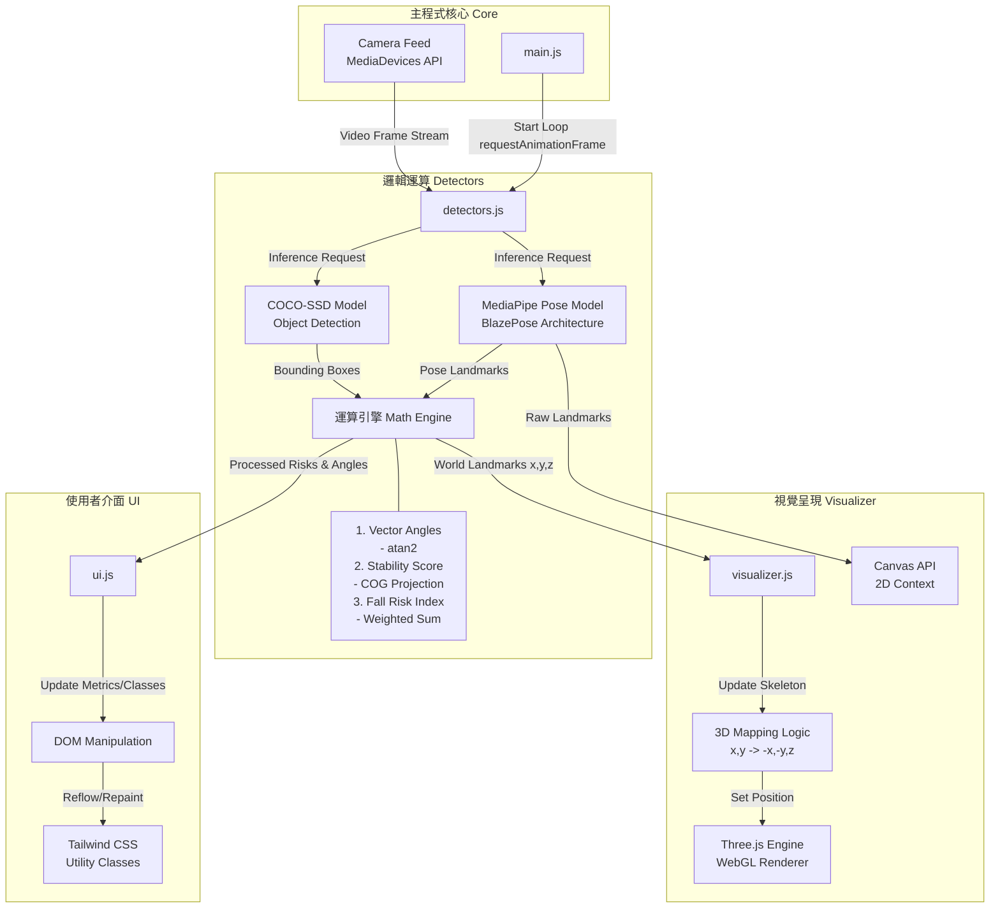

# 專案技術文件：FallGuard AI 系統架構與邏輯解析

本文檔旨在完整描述本專案的系統架構、數學邏輯、模組關聯以及關鍵語法，供技術面試或後續開發參考。

## 一、 系統架構與檔案連接邏輯 (System Architecture)

### 1. 模組關係詳解圖 (Detailed Module Relationship)

本圖展示了各個模組 (**Modules**) 內部使用的核心演算法 (**Algorithms**) 以及資料流向。



### 2. 模組節點詳細註解 (Module Node Annotations)

以下表格詳細說明了架構圖中每個節點的技術細節與應用公式：

| 模組節點 (Node) | 核心功能 (Function) | 關鍵技術 (Technology) | 應用公式/邏輯 (Formulas & Logic) |
| :--- | :--- | :--- | :--- |
| **Main.js** | 系統啟動與主迴圈控制 | `requestAnimationFrame`, `Async/Await` | 確保 60FPS 幀率穩定；依序初始化 `Visualizer` -> `Detectors` -> `Camera`。 |
| **Camera** | 獲取影像串流 | `navigator.mediaDevices.getUserMedia` | 使用 `{ width: { ideal: 1280 } }` 請求高畫質影像，並處理權限請求。 |
| **Detectors.js** | **(大腦)** AI 推論與物理運算 | Singleton Pattern, Module Pattern | 負責協調 AI 模型與數學計算，將原始數據轉化為業務指標。 |
| **MediaPipe** | 人體骨架偵測 | `Google MediaPipe Pose`, `WebAssembly` | 輸出 33 個關鍵點 $(x, y, z)$。模型經過大量 3D 動作捕捉數據訓練。 |
| **COCO-SSD** | 環境障礙物偵測 | `TensorFlow.js`, `MobileNet` | 輸出 `[x, y, width, height]` Bounding Box。用於識別椅子、背包等絆倒風險。 |
| **MathEngine** | **(核心)** 物理數學運算 | **Geometry & Physics** | 1. **膝蓋角度**: $\theta = |\text{atan2}(v_1) - \text{atan2}(v_2)|$<br>2. **穩定度**: $100 - |COG_x - Base_x| \times k$<br>3. **風險值**: $\sum (Risk_i \times Weight_i)$ |
| **Visualizer.js** | **(眼睛)** 3D/2D 渲染 | `Three.js` (WebGL), Canvas API | 負責將數據視覺化。使用 `BufferGeometry` 優化效能 (不重複建物件)。 |
| **Map3D** | 座標映射轉換 | `Vector Mapping` | MediaPipe $(x, y, z)$ $\rightarrow$ Three.js $(-x, -y+offset, -z)$。解決座標系方向不同(Y軸上下顛倒)的問題。 |
| **Three.js** | 3D 場景管理 | `WebGLRenderer`, `Scene`, `Camera` | 建立虛擬 3D 空間，繪製骨架球體 (Joints) 與連線 (Bones)。 |
| **UI.js** | **(臉)** 使用者介面 | `DOM API` | 負責更新 HTML 元素的文字、寬度 (ProgressBar) 與顏色。 |
| **Tailwind** | 樣式與動畫 | `Utility-First CSS`, `Transition` | 使用 `duration-300 ease-out` 實現數據變化的平滑過渡效果。 |

---

## 二、 核心演算法細節與公式 (Algorithms & Formulas Deep Dive)

這部分詳細列出程式碼中的數學公式。

### 1. 向量角度計算 (Vector Angles)
用於評估膝蓋受力 (Knee Pressure) 與脊椎姿勢 (Spine Health)。

*   **公式**: $\theta = |atan2(Cy - By, Cx - Bx) - atan2(Ay - By, Ax - Bx)|$
*   **程式碼 (`detectors.js`)**:
    ```javascript
    calculateAngle(a, b, c) {
        // b 是頂點 (例如膝蓋)
        // atan2 返回 -PI 到 PI 的弧度
        const radians = Math.atan2(c.y - b.y, c.x - b.x) - Math.atan2(a.y - b.y, a.x - b.x);
        let angle = Math.abs(radians * 180.0 / Math.PI);
        if (angle > 180.0) angle = 360.0 - angle; // 確保角度取銳角側 (0-180)
        return angle;
    }
    ```

### 2. 穩定度分析 (Stability Analysis)
用於評估使用者是否站立不穩。

*   **物理概念**: 重心 (COG) 偏移出 支撐基底 (Base of Support)。
    *   **COG**: 近似為兩髖中心 `(LeftHip + RightHip) / 2`。
    *   **Base**: 近似為兩腳踝中心 `(LeftAnkle + RightAnkle) / 2`。
*   **公式**: 
    ```javascript
    // 歸一化偏移量 (Normalized Deviation)
    const deviation = Math.abs(hipX - ankleX);
    // 映射到 0-100 分數。係數 500 是經驗值，代表偏移 0.2 (屏幕寬度的 20%) 就視為 0 分。
    const score = Math.max(0, 100 - (Deviation * 500));
    ```

### 3. 障礙物距離判定 (Obstacle Proximity)
使用歐式距離公式 (Euclidean Distance) 判斷使用者與物體的距離。

*   **公式**: $Distance = \sqrt{(x_2 - x_1)^2 + (y_2 - y_1)^2}$
*   **Javascript 語法**: `Math.hypot(dx, dy)` 是最高效的寫法。
*   **邏輯**:
    ```javascript
    // 用腳的位置 (feetX, feetY) 與 物體中心 (boxCenter) 比較
    const dist = Math.hypot(boxCenter.x - feetX, boxCenter.y - feetY);
    if (dist < 0.2) // 距離小於 20% 畫面寬度
        obstacleDetected = true;
    ```

---

## 三、 專案連接邏輯總結 (Connection Logic Summary)

1.  **Main Loop (主迴圈)**: `main.js` 啟動 `requestAnimationFrame`，這是一個無窮迴圈，每秒約執行 60 次。
2.  **Data Flow (資料流)**:
    *   **Input**: Camera Video Element.
    *   **Processing**: `Detectors` 讀取 Video -> MediaPipe 推論 -> 獲得 `Landmarks`。
    *   **Analysis**: `Detectors` 將 Landmarks 代入上述數學公式 -> 獲得 `Risk/Stability` 數值。
    *   **Output A (3D)**: `Visualizer` 讀取 `Landmarks` -> 更新 Three.js 骨架。
    *   **Output B (UI)**: `UI` 讀取 `Risk` 數值 -> 更新 DOM 元素寬度與顏色。

透過這種單向資料流 (Unidirectional Data Flow)，我們確保了系統的穩定性與可追蹤性。
